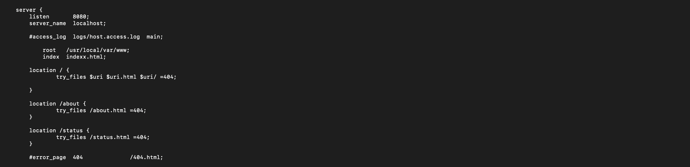
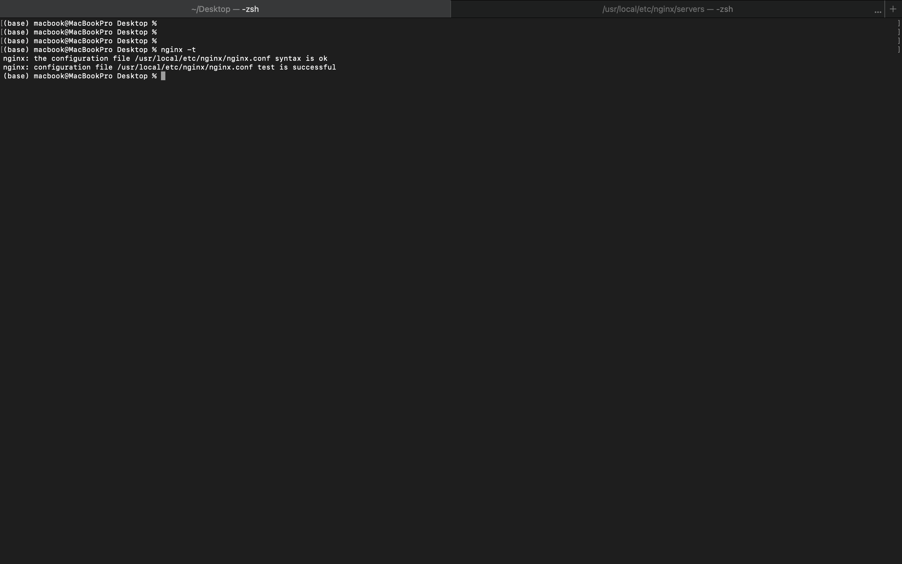
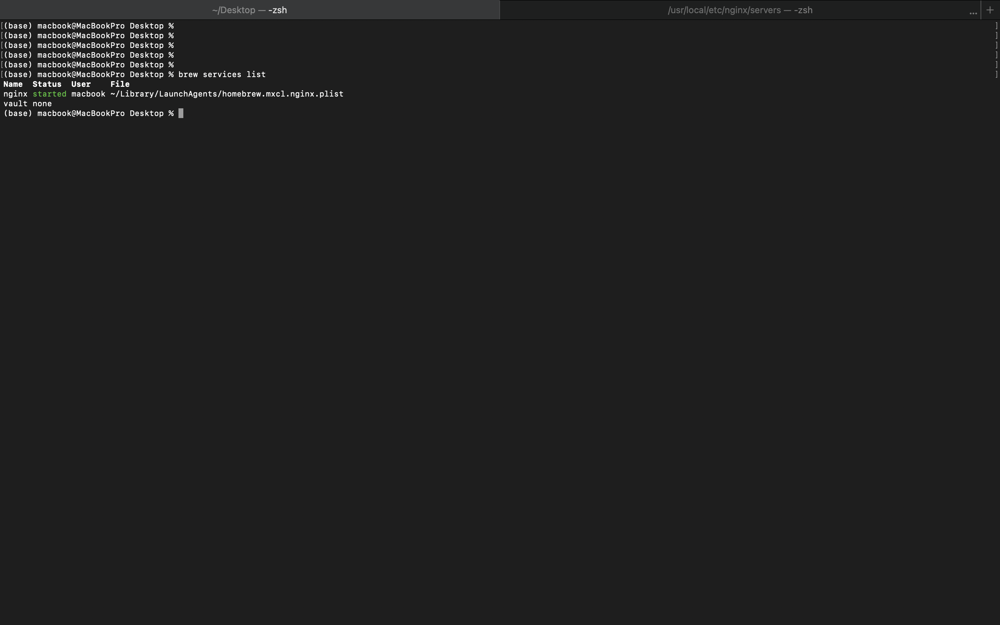
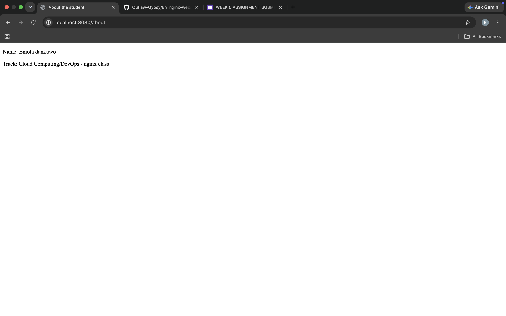
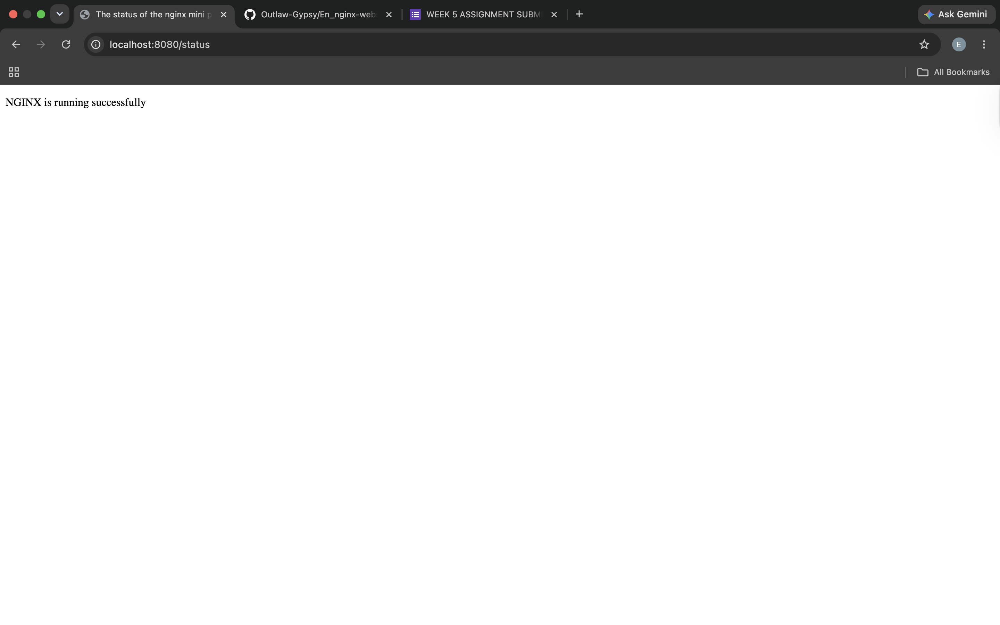

# NGINX MINI DASHBOARD PROJECT

## 📌 Project Overview

This project demonstrates how to configure and deploy a simple multi-page website using NGINX as a web server. It serves multiple HTML pages locally and configures clean routing for each page.

---

## ⚙️ Technologies Used

- NGINX Web Server  
- HTML5  
- Bash Terminal  
- Git & GitHub  

---

## 🎯 Project Objectives

- Install and run NGINX locally  
- Host multiple HTML pages on a single server  
- Configure routing using NGINX location blocks  
- Validate configuration using nginx -t  
- Document the process with screenshots  
- Push project to GitHub  

---

## 🌐 NGINX Configuration



---

## 🧪 NGINX Configuration Test

bash
nginx -t



## 🚀 NGINX Server Status


---

# 🏠 Web Pages

## Home page


## About Page


## Status Page


---

## 📂 Project Structure
nginx-mini-dashboard/
│
├── html/
│   ├── index.html
│   ├── about.html
│   └── status.html
│
├── configs/
│   └── nginx.conf
│
├── screenshots/
│   ├── nginx_conf.png
│   ├── nginx-text-success.png
│   ├── nginx-running.png
│   ├── home_page.png
│   ├── about_page.png
│   └── status_page.png
│
└── README.md
---

## 📌 Key Learnings

* How NGINX serves static websites
* How routing works using location blocks
* How to test and reload NGINX safely
* Git and GitHub workflow basics

---

## 🚀 How to Run
```
brew services start nginx
nginx -t
nginx -s reload
```
### Open:
```
http://localhost:8080
```


 


